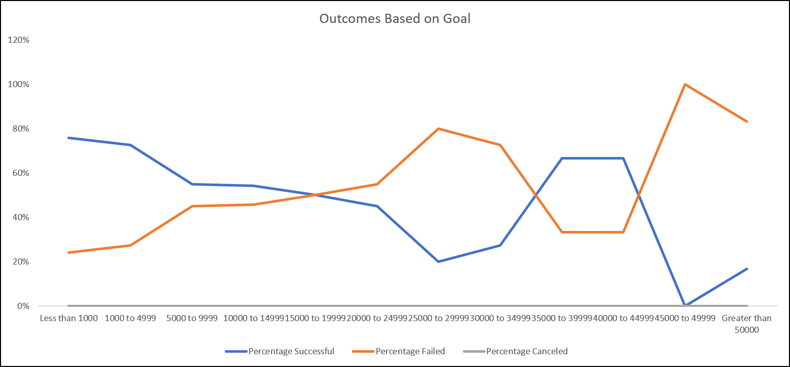

# An Analysis of Kickstarter Campaigns
## Overview of Analysis
The intent of this analysis was to identify any correlation between overall success of theatre kickstarter campaigns as it relates to 1) the overall timing of when a campaign started and 2) setting and hitting fundraising goals for individual campaigns
## Analysis and Challenges
### Theatre Outcomes based on Launch Date
For this specific question, we simply wanted to identify if there was a trend on which month was the most successful for starting campaigns. For this analysis, it was fairly simple as we took the outcomes from the different campaigns, and plotted them by month. Based on the image below, you can see the overall trend: 

### Outocmes based on Goals
For this analysis there are 2 questions 1) What fundraising goal (in dollars) was the most successful and 2) What fundraising goal was the least successfull. By answering these two quesitons, we can help identify what an appropriate goal amount should be for future campaigns. To conduct this analysis , we simply needed to create common groupings of goals to categorize the data. Based on the different groupings, we simply counted up the total number of Successful, Failed, and Canceled campaigns that fell within each of the ranges. To identify a success or failure rate, we took the total number for Successful, Failed, and Canceled and divided them against the overall total number of campaigns. The graph below shows the outcomes:

### Challenges and Difficulties
The only real challenge or difficulty with this data set was adjusting the start and end dates of the campaigns. This was in unix code originally but after it was adjusted to excel, there were no problems.

## Results

### What are two conclusions you can draw about the Outcomes based on Launch Date?
- May is the most successful month to start a campaign. A potential reason might be due to seasonalty of people being on vacation and wanting to see plays/theatre. 
- December is the least successful month to start a campaign. This could be in part due to the Christmas holiday and additional dollars and budget available during that time
### What can you conclude about the Outcomes based on Goals?
- It appears that smaller goals for fundraisers are more successful (e.g., less than $1k) than compared to large goals (e.g., $45k-$49k). Large goals might be obtained by a few large donations compared to ease of achieving multiple smaller donations that are more manageable.
### What are some limitations of this dataset?
- There's really nothing to compare Louise’s campaign against other campaigns. If she were to identify how other organizations fared, it would be a more thorough comparison against competition.
### What are some other possible tables and/or graphs that we could create?
- For starters, it would be helpful to identify the average contribution for each outcome of the campaigns. If we identify what the average contribution was, we'd be able to identify and set a goal based on the number of backers instead of overall contributions. Additionally, we could focus on which parent category or subcategory was the most successful.
