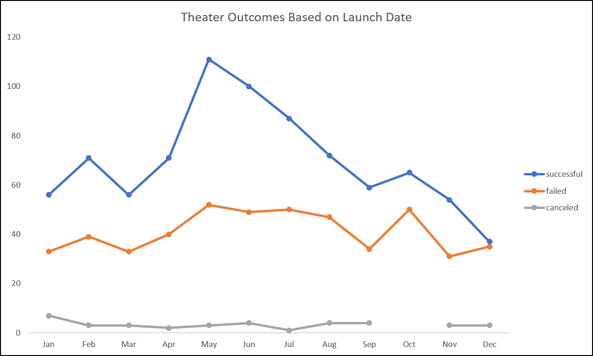

# An Analysis of Kickstarter Campaigns
## Overview of Analysis
The intent of this analysis was to identify any correlation between overall success of theatre kickstarter campaigns as it relates to 1) the overall timing of when a campaign started and 2) setting and hitting fundraising goals for individual campaigns
## Analysis and Challenges
### Theatre Outcomes based on Launch Date
For this specific question, we simply wanted to identify if there was a trend on which month was the most successful for starting campaigns. For this analysis, it was fairly simple as we took the outcomes from the different campaigns, and plotted them by month. Based on the image below, you can see the overall trend: 

### Outocmes based on Goals
For this analysis there are 2 questions 1) What fundraising goal (in dollars) was the most successful and 2) What fundraising goal was the least successfull. By answering these two quesitons, we can help identify what an appropriate goal amount should be for future campaigns. To conduct this analysis , we simply needed to create common groupings of goals to categorize the data. Based on the different groupings, we simply counted up the total number of Successful, Failed, and Canceled campaigns that fell within each of the ranges. To identify a success or failure rate, we took the total number for Successful, Failed, and Canceled and divided them against the overall total number of campaigns. The graph below shows the outcomes:

